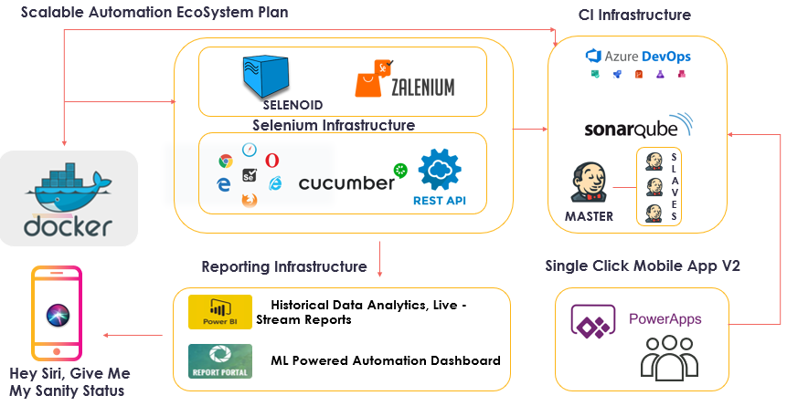
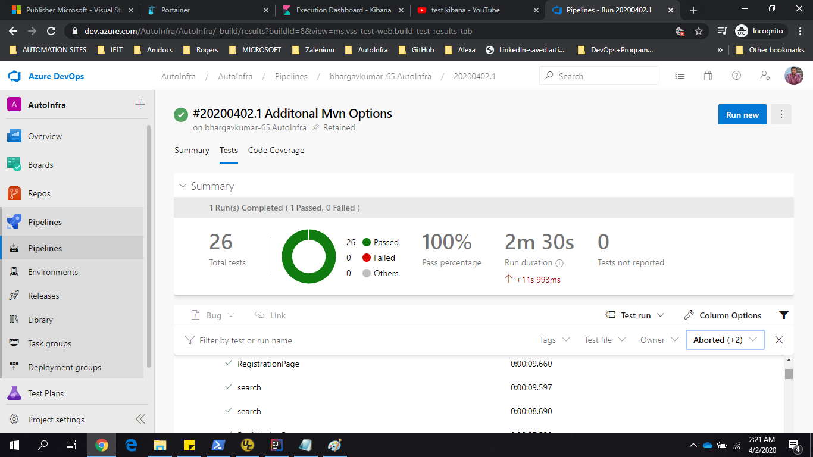
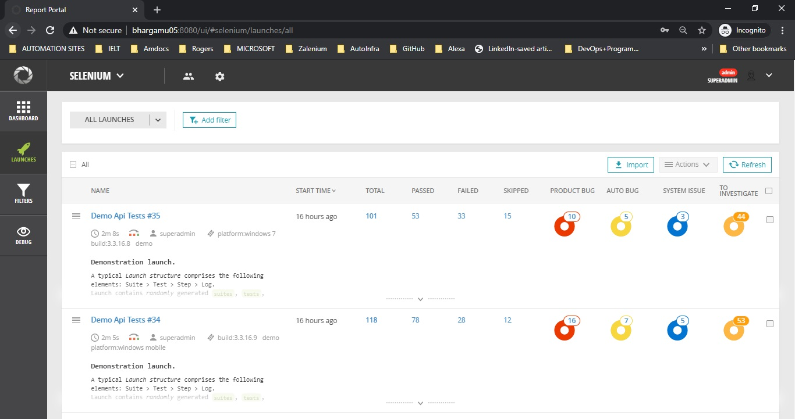
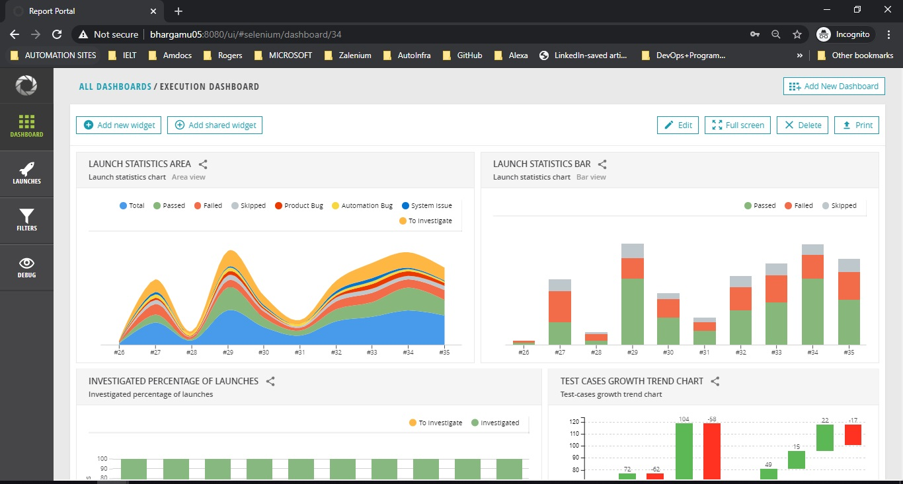
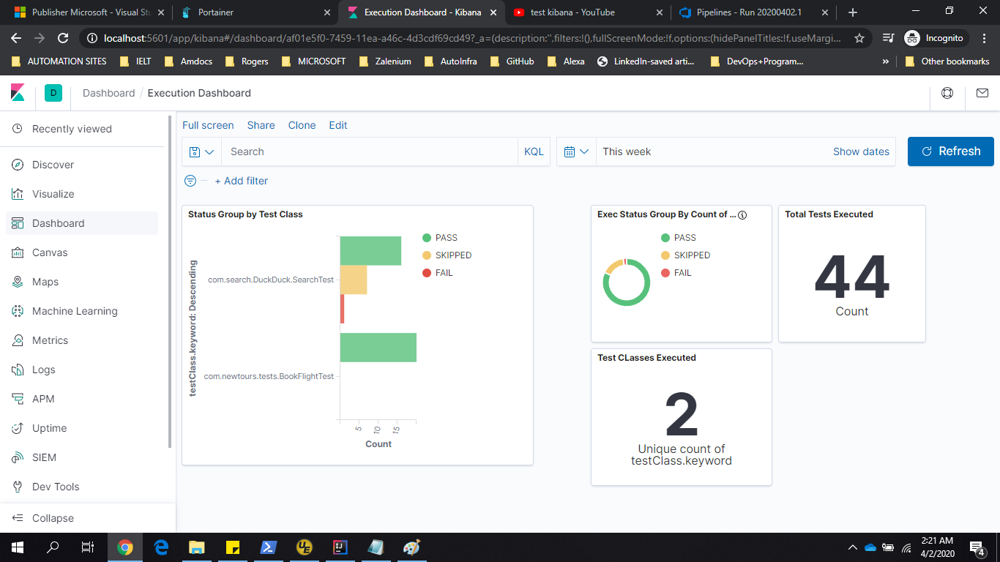
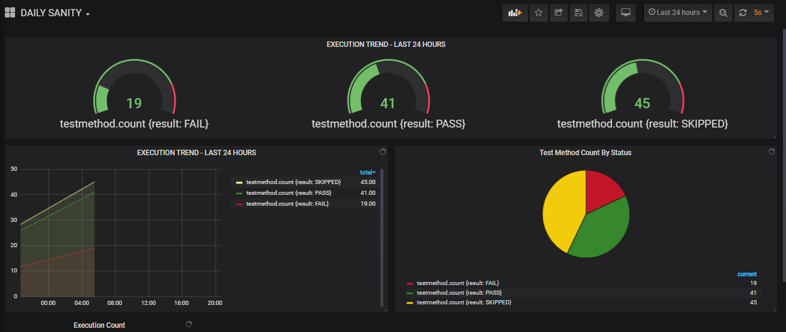
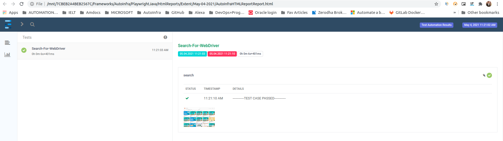

# Project Automation-Selenium-Docker-Java
##### Main Objective of this Framework is to Build an Automation Framework that can be scalable, Easily Configurable and Ready to Deploy in any CLOUD on Dockers.

##### My primary focus is simplicity, Ease of use Framework that Cover Todays Software Testing Needs. I tried to make it as generic and reusable as possible. In the worst case, you can use this as a learning guide for your projects.
## UpComing Features [planned to release SOON]

> [**“Implementing Factory Pattern"**]() 
> — Fatory design pattern to initialize webdriver

### Some Interesting Tools Used in this fraework
1.  Docker v17 and above.
2.  Intellij
3.  [**Azure DevOps For Continuous Integration**]()  
4.  [**PowerBI For Streaming Test Results**]()  
5.  Jenkins
6.  [**SonarQube For Bug Free Automation Code**]()  
7.  [**ReportPortal.io For Machine Learning Reports**]()  
8.  Grafana + InfluxDB
9.  Elastic Search + Kibana
10. [**Healenium For Self Healing Selenium**]()  
11. Jira

<h2 align="center">Project Architecture</h2>

<h2 align="center">Azure Pipelline Reports</h2>

<h2 align="center">Machine Learning Reports</h2>

<h2 align="center">ReportPortal.io Live Execution Dashboard</h2>

<h2 align="center">Elastic Search Reports</h2>

<h2 align="center">Grafana Reports</h2>

<h2 align="Left">Extent Reports</h2>

